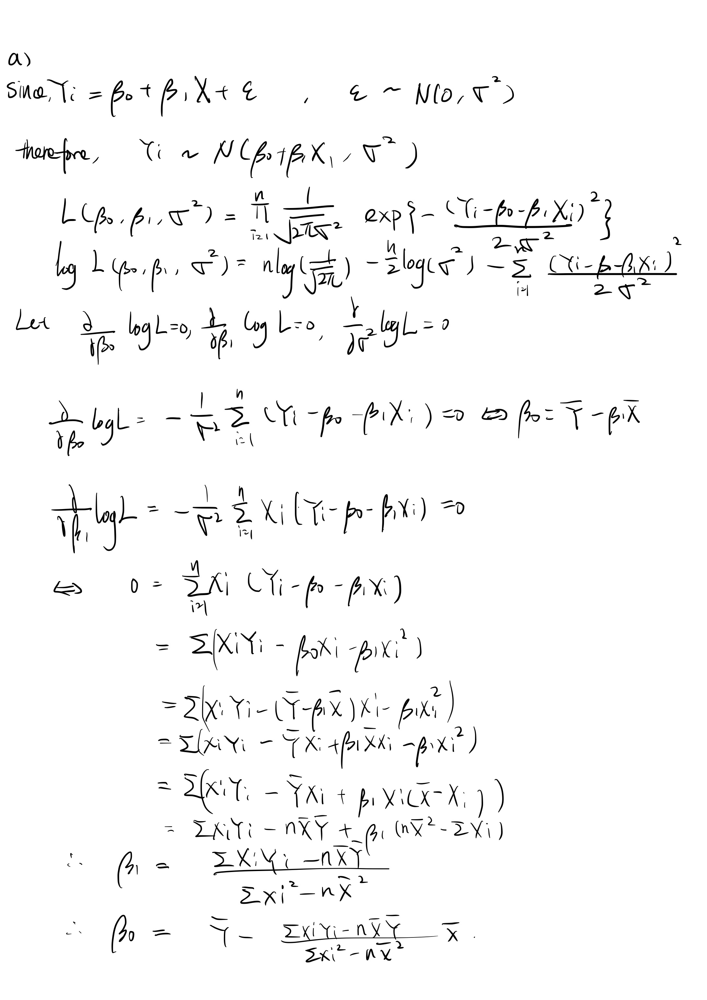
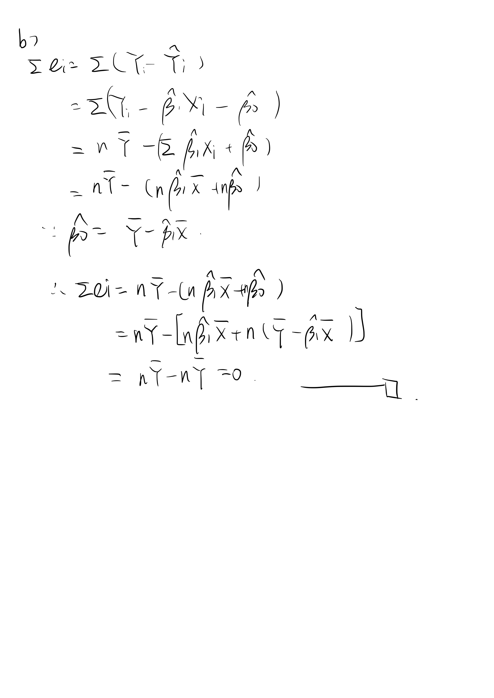

         
```{r setup, include=FALSE}
library(tidyverse)
library(viridis)
library(patchwork)
library(arsenal)
library(dplyr)
knitr::opts_chunk$set(
  fig.width = 6,
  fig.asp = 0.6,
  out.width = "100%",
  message = F,
  echo = F,
  warning = F
)
theme_set(theme_minimal() + theme(legend.position = "bottom"))
options(
  ggplot2.continuous.colour = "viridis",
  ggplot2.continuous.fill = "viridis",
  digits = 3
)
scale_colour_discrete = scale_color_viridis_d
scale_fill_discrete = scale_fill_viridis_d
set.seed(2844)
```

# Problem 1


```{r igm_clean}
igm_df <- read.csv("./data/Antibodies.csv")


igm_df = 
  igm_df %>% 
  mutate(
    AgeCategory = as.factor(AgeCategory),
    Smell = as.factor(Smell),
    Gender = as.factor(Gender)
  )

my_labels <- list(AgeCategory = "Age(yrs)", Antibody_IgM = "IgM", Smell="Smell", Gender="Gender")
my_controls <- tableby.control(
               total = F,
               test=F,
               numeric.stats = c("meansd", "medianq1q3", "range", "Nmiss2"),
               cat.stats = c("countpct", "Nmiss2"),
               stats.labels = list(
               meansd = "Mean (SD)",
               medianq1q3 = "Median/IQR",
               range = "Min - Max",
               Nmiss2 = "Missing",
               countpct = "N (%)"))

tab1 <- tableby(Smell ~  Antibody_IgM, data = igm_df, control=my_controls)
summary(tab1, title = "Descriptive Statistics: Antibodies Data", labelTranslations = my_labels, text=T) %>% 
  knitr::kable()


rank_sum_norm = 
  igm_df %>%
  filter(Smell == "Normal") %>% 
  drop_na() %>% 
  select(Antibody_IgM)

rank_sum_alter = 
  igm_df %>% 
  filter(Smell == "Altered") %>%
  drop_na() %>% 
  select(Antibody_IgM)

qqnorm(rank_sum_norm$Antibody_IgM, main = "Q-Q Plot for Normal group")
qqnorm(rank_sum_alter$Antibody_IgM, main = "Q-Q Plot for Altered group")
```


From the descriptive statistic and the qq-plots above, we can see that the IgM between two groups are skewed and un-paired. So I decided to use non-parametric method ---- Wilcoxon Rank-Sum test.

Let $T_{1}$ be the sum of the ranks of the IgM levels of the Normal group, and let $T_{2}$ be the levels of the Altered group.

And the hypotheses to be tested are:

$H_0:$ the medians of the two groups are equal.
$H_1:$ the medians of the two groups are not equal.

And the $T_{stat}$:
$$
\begin{aligned}
T_{stat} = \frac{\left|T_{1}-\frac{n_{1}\left(n_{1}+n_{2}+1\right)}{2}\right|-\frac{1}{2}}{\sqrt{\left(n_{1} n_{2} / 12\right)\left(n_{1}+n_{2}+1\right)}}\\
\end{aligned}
$$
And if ties:
$$
\begin{aligned}
T_{stat}=\frac{\left|T_{1}-\frac{n_{1}\left(n_{1}+n_{2}+1\right)}{2}\right|-\frac{1}{2}}{\sqrt{\left(n_{1} n_{2} / 12\right)\left[\left(n_{1}+n_{2}+1\right)-\sum_{i=1}^{g} t_{i}\left(t_{i}^{2}-1\right) /\left(n_{1}+n_{2}\right)\left(n_{1}+n_{2}-1\right)\right]}}\\
\end{aligned}
$$
where $t_i$ refers to the number of observations with the same absolute value in the $i^{th}$ group and $g$ is the number of tied groups.
```{r rank_df}
rank_df = 
  igm_df %>% 
  filter(Smell != "Unanswered/Others") %>% 
  drop_na(Smell, Antibody_IgM)
rank_df = 
  rank_df %>% 
  mutate(
    rank = rank(Antibody_IgM)
  ) %>% 
  pivot_wider(
    names_from = Smell,
    values_from = Antibody_IgM
  ) %>% 
  arrange(rank) %>% 
  select(rank, Normal, Altered)
```

```{r wilcoxon_rank_sum}
non_para_test =
  wilcox.test(rank_df %>% pull(Normal),rank_df %>% pull(Altered),mu = 0 ) %>% 
  broom::tidy()

t_1 = 
  rank_df %>% 
  drop_na(Normal) %>% 
  summarise(t1 = sum(rank)) %>% 
  pull(t1)

ties = 
  rank_df %>% 
  count(rank) %>% 
  filter(n>1) %>% 
  pull(n)

n_1 = nrow(drop_na(rank_df, Normal))

n_2 = nrow(drop_na(rank_df, Altered))

statistic =
  non_para_test$statistic +n_1*(n_1 + 1)/2

T = (abs(t_1 - n_1 * (n_1+n_2 + 1) / 2) - 0.5)

T = T/sqrt(n_1*n_2/12 * (n_1 +n_2 + 1 - sum(ties*(ties^2-1))/((n_1+n_2)*(n_1+n_2-1))))

rank_df %>% 
  head(10) %>% 
  knitr::kable()
```

As we can see, there are ties, so we need to adjust the $T_{stat}$. Where $T_1 = `r t_1`$, $g = `r ties %>% sum()`$.

**Decision Rules:**

Under normal-approximation:$n_1~and~n_2\geq10$ , where $n_1 = `r n_1`$, and $n_2 = `r n_2`$.

Reject $H_0$ if $T_{stat}>z_{1-\alpha/2}$.

P-value = \( 2 \times [1-\Phi(T_{stat})] \)

In our situation, \(T_{stat} =`r T`>z_{0.975}=`r qnorm(0.975)` \), and p-value is \(`r non_para_test$p.value`\). We reject the null hypothesis and conclude that the medians of the Normal and Altered smell categories are not equal (using a 0.05 significant level). 


# Problem 2 

```{r}


```
\newpage
```{r}

```
\newpage

# Problem 3


## 1.

Generate a scatter plot and test whether a linear association exists between student’s ACT
score (X) and GPA at the end of the freshman year (Y). Use a level of significance of 0.05.
Write the hypotheses, test statistics, critical value and decision rule with interpretation in the
context of the problem. 


```{r gpa_data}
gpa_data = read.csv("./data/GPA.csv")

plot(gpa_data$ACT, gpa_data$GPA)

reg_gpa = lm(GPA ~ ACT, data = gpa_data)
gpa_test = anova(reg_gpa)

beta_1 = 
  reg_gpa %>% 
  broom::tidy() %>% 
  filter(term == "ACT") %>% 
  pull(estimate)

beta_0 = 
  reg_gpa %>% 
  broom::tidy() %>% 
  filter(term != "ACT") %>% 
  pull(estimate)

std_beta_1 = 
  reg_gpa %>% 
  broom::tidy() %>% 
  filter(term == "ACT") %>% 
  pull(std.error)

```


$H_0~:~\beta_1 = 0$

$H_1~:~\beta_1\ne 0$ 

$error~sum~of~squares(SSE) = \sum_{i=1}^k(y_{i}-\bar{y})^2$

$regression~sum~of~squares(SSR) = \sum_{i=1}^k(\hat{y_{i}}-\bar{y})^2$

$MSR = \frac{\sum_{i=1}^k(\hat{y_{i}}-\bar{y})^2}{k-1}~(k=2)$

$MSE = \frac{\sum_{i=1}^k(y_{i}-\bar{y})^2}{n-k}~(n=120)$

$F_{stat} = \frac{MSR}{MSE} \sim F(k-1,n-k)$


**Decision Rules:**

$Reject ~ H_0 ~ if ~ F_{stat}>F_{k-1,n-k,1-\alpha}$

$Fail ~ to ~ reject ~ H_0 ~ if ~F_{stat}<F_{k-1,n-k,1-\alpha}$

In our situation, $F_{stat} = `r gpa_test %>% broom::tidy() %>% drop_na() %>% pull(statistic)` >F_{0.95,1,118}=`r qf(0.95,1,118)`$
, we reject the Null hypothesis at 0.95 confidence level and conclude that there's linear 
association between GPA and ACT.

## 2. 

Write the estimated regression line equation:

$$GPA = \hat{\beta_0} + \hat{\beta_1} \times ACT$$

$$GPA = `r beta_0 %>% round(3)` + `r beta_1 %>% round(3)`\times ACT$$
```{r gpa_reg_plot}
pre_int <- predict(reg_gpa, interval = "prediction")

plot_data <- cbind(gpa_data, pre_int)

reg_plot <- ggplot(plot_data, aes(x = ACT, y = GPA)) +
  geom_point() +
  stat_smooth(method = lm)

reg_plot + 
  geom_line(aes(y = lwr), color = "red", linetype = "dashed") +
  geom_line(aes(y = upr), color = "red", linetype = "dashed") +
  ggtitle("Regression model of ACT test score and freshman year GPA")
```


## 3. 

```{r reg_ci}
confint(reg_gpa) %>% 
  knitr::kable()

```
Confidence Interval for $\beta_1$ is :
$$\hat{\beta_1} \pm t_{n-2, 1-\alpha/2} \times se(\hat{\beta_1})$$
$$= `r beta_1` \pm `r qt(0.975,nrow(gpa_data)-2)`\times  `r std_beta_1`
$$

$$(0.014, 0.064)$$

So at 95% confidence level doesn't contain 0. The director of admissions might be interested in whether the confidence interval includes zero this association because that means how much the mean GPA changes when there is one unit change in ACT score. If the 95% CI contains 0, it's hard to say whether the better ACT score brings to better performance in GPA or not.
## 4.

```{r pred_ci}

ci_pred = predict(reg_gpa, data.frame(ACT = 28), interval = "confidence") %>% as.tibble()

lwr_ci = ci_pred %>% pull(lwr) 
upr_ci = ci_pred %>% pull(upr)
```
The 95% CI for $ACT = 28$ is $(`r lwr_ci`,`r upr_ci`)$. That means the true mean of estimator $GPA$ lies between in this range, with 95% confidence.

## 5. 


```{r pred_pi}
pi_pred = predict(reg_gpa, data.frame(ACT = 28), interval = "prediction") %>% as.tibble()

lwr_pi = pi_pred %>% pull(lwr) 
upr_pi = pi_pred %>% pull(upr)
```

The 95% CI for $ACT = 28$ is $(`r lwr_pi`,`r upr_pi`)$. That means the true estimator $GPA$ lies between in this range, with 95% confidence.

## 6.

PI is wider than CI, because CI is the interval of the mean of the estimator while PI is the interval of the estimator itself, the standard error of the mean of the estimator is less than that of the estimator, so we got a narrower interval in CI.

